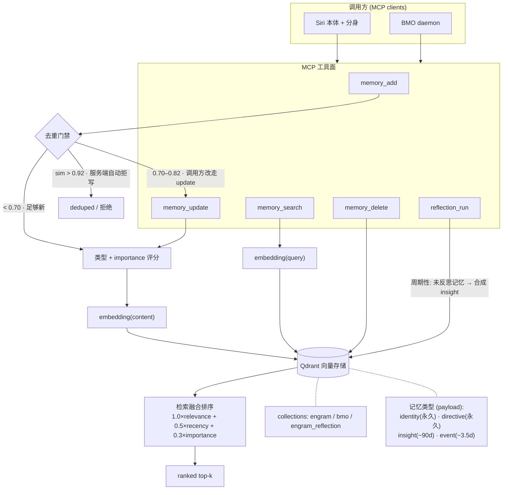

# Engram

**Engram 是给 AI agent 用的长期记忆系统。** 它不是又一个向量库的封装层，而是围绕「记忆的生命周期」做了一套治理：写入前先判断值不值得记、是不是已经记过；检索时按 重要性 × 时效 × 相关性 三因子融合排序，而不只看相似度；不同性质的记忆按类型分级遗忘；还能周期性自反思、把零散记忆合成洞察。底层用向量检索（Qdrant），但向量检索只是它的一个零件。Engram 以 MCP server 形式运行，对外暴露 `memory_add / memory_search / memory_update / memory_delete / reflection_run` 五个工具，目前服务于 BMO 与 Siri（本体 + 分身）的记忆。用 Go 重写自早期的 chat2mem。

> 想 5 分钟跑起来直接跳到 [§5 快速上手](#5-快速上手5-分钟跑起来)；想先搞懂「这跟我已经在用的向量库 / RAG 有啥区别」看 [§3 差异定位](#3-差异定位)。

---

## 1. 问题（Problem）

给 agent 加记忆，最直觉的做法是：把每一句对话、每一个事实、每一条日志，全都 embedding 一下塞进向量库，需要时语义检索 top-k。这套方案上手十分钟就能跑通，然后在第三周开始崩。

**它崩在四个地方：**

- **上下文腐烂（context rot）。** 向量库只会无脑追加。三个月后里面堆了几万条向量，一次检索召回的 top-k 里混着大量擦边的噪声——相似度 0.6 的陈年碎片和今天真正相关的事实抢同样的位置。召回率没降，但信噪比掉到地板。
- **没有遗忘。** 人脑的记忆会随时间和重要性自然衰减，向量库不会。半年前一句随口的寒暄，和一条「Frank 要求改生产配置前必须先问」的硬约束，在库里权重一模一样。该忘的不忘，记忆就成了垃圾场。
- **没有重要性。** 检索只认语义相似度。它无法表达「这条比那条更要紧」。于是一条关键指令可能被十条语义更贴近、但实际无关紧要的闲聊淹没。
- **重复碎片。** 同一个事实被不同对话反复说起，就被反复写进去。十条措辞略不同、说的是同一件事的向量，既浪费检索预算，又让 top-k 被同义重复占满，挤掉本该出现的其他信息。

把这些加起来，结论很清楚：**向量数据库是一个检索原语，不是一套记忆系统。** 它解决「在一堆东西里按语义找相似」，但 agent 的长期记忆要解决的是另一组问题。

**一个 agent 真正需要的记忆，得能回答：**

1. 这条信息**值不值得记**？（写入要有门槛，不是来者不拒）
2. 我是不是**已经记过**了？（写入要去重，不堆同义碎片）
3. 哪些记忆**更重要**、哪些该**随时间淡出**？（检索要按 重要性 × 时效 × 相关性 排序，不只看相似度）
4. 这条记忆是**什么性质**的——是关于「我是谁」的永久事实，还是一件转瞬即逝的小事？（不同性质的记忆，遗忘速率和召回权重就该不同）

**Engram 就是冲着这四个问题去的。** 它不是又一个向量库的封装层，而是把「写入门槛、语义去重、重要性评分、按类型分级的时间衰减、检索融合、以及 reflection 自反思」做成一套围绕 agent 记忆生命周期的系统。底层依然用向量检索（Qdrant），但向量检索只是它的一个零件，不是它的全部。

简单说：**向量库帮你「找到相似的东西」，Engram 帮你「记住该记的、忘掉该忘的、并在对的时刻把对的记忆拿出来」。** 这就是区别。

---

## 2. Engram 是什么

**Engram 是一个 agent 记忆服务：你往里 `add` 事实，它替你做去重和评分；你 `search` 一个问题，它把最相关、最重要、最新鲜的记忆排好序还给你。** 它以 MCP server（stdio）形式运行，任何 MCP client（Claude Desktop、Army of the Agent 等）接上就能用。

对外只有五个工具，覆盖记忆的完整生命周期：

| 工具 | 干什么 |
|---|---|
| `memory_add` | 写一条记忆（带 `type` / `importance` / `tags`），内置去重 |
| `memory_search` | 语义检索，返回经三因子融合排序的 top-k |
| `memory_update` | 语义定位旧记忆 → 替换（用于「同一件事换了说法」的更新） |
| `memory_delete` | 删除记忆（`identity` / `directive` 类型受删除保护） |
| `reflection_run` | 触发一轮自反思：从未反思的记忆里合成新 `insight` |

一个最小例子（存一条偏好、再搜出来）：

```
memory_add(
  content="Frank prefers concise commit messages, imperative mood, no emoji.",
  type="identity", importance=8, tags=["frank", "preference"]
)
memory_search(query="how does Frank like commit messages", limit=3)
```

返回的 `score` 不是裸的 cosine 相似度，而是 `relevance × recency × importance` 融合后的排序分——这就是 Engram 和「直接查向量库」第一个肉眼可见的区别。

底层：用 **Go** 重写自早期的 chat2mem 原型，存储后端是 **Qdrant**。记忆按 collection 物理隔离（当前在用的是 `engram`、`bmo`、`engram_reflection`）。

---

## 3. 差异定位

新人最大的困惑是「这和我已经在用的东西有啥区别」。正面回答三个对照：

**vs 向量数据库（Qdrant / pgvector / Pinecone…）**
向量库是 Engram 的**存储后端**，不是替代品。区别在于它之上的那层治理：向量库给你「按语义找相似」，但不管写入门槛、不管去重、不管重要性、不会遗忘、不会自反思。Engram 把这些都加上了——你可以把它理解成「一个带记忆纪律的向量库」。

**vs RAG**
RAG 是**读时**行为：查询时去外部文档库检索一段上下文，拼进 prompt，用完即弃。Engram 是**写时**就做质量治理的**持久记忆**：信息在写入那一刻就被去重、评分、归类，并会随时间衰减、被反思合成。RAG 解决「我的知识在外部文档里」，Engram 解决「我的 agent 自己积累、并要长期维护的记忆」。两者正交，可以同时用。

**vs 普通 KV / 会话记忆**
KV 记忆靠精确 key 命中，没有语义召回、没有重要性、没有去重——本质是个带 key 的存储。Engram 的每一条记忆都可被语义检索、带重要性权重、会按类型遗忘、写入时自动去重。

---

## 4. 核心概念

五个概念，建立起来就懂 Engram 在做什么。

**① 4 种记忆类型 —— 决定遗忘速率与召回权重**

| 类型 | 半衰期 | 典型内容 |
|---|---|---|
| `identity` | 永久（不衰减） | 关于「我是谁」、价值观、长期偏好 |
| `directive` | 永久（不衰减） | 行为规则、硬约束、Frank 的指令 |
| `insight` | ~90 天 | 洞察、经验教训、技术观察 |
| `event` | ~3.5 天 | 发生过的具体事件、临时事实 |

类型不是僵硬的子类目——更细的区分交给 `tags`。类型只负责一件事：**这条记忆该活多久、被召回时权重多大。**

**② importance（1–10）—— 设准比设高重要**
重要性参与检索排序。它的价值在于「准」而不是「高」：把什么都设成 9，等于没设。该是 3 的小事就标 3，让真正的硬约束（8+）能在排序里浮上来。

**③ 去重 —— 写入要有门槛**
写入不是来者不拒。Engram 用三层逐级收紧的门禁挡住重复与碎片，详见 [§5b 三层写入门禁](#5b-三层写入门禁write-gate--去重纪律)。一句话：**0.92 防逐字复制，0.70–0.92 防语义碎片，类型+importance 防记忆错配。**

**④ 检索融合 —— 不只看相似度**
`memory_search` 的排序分是三因子融合：

```
score = 1.0 × relevance + 0.5 × recency + 0.3 × importance
```

同样语义相关的两条，更新鲜、更重要的那条排在前面。这直接对应第 1 章的「没有重要性」「没有遗忘」两个痛点。

**⑤ reflection —— 周期性自反思**
`reflection_run` 会从「尚未反思过」的记忆里，用 LLM 合成更高层的 `insight`，并把源记忆标记为已反思。它有节流（最小间隔 + 每日上限），避免反复烧 token。这是 Engram 从「被动存取」走向「主动整理」的一步：零散的 event 经反思沉淀成可复用的 insight。

---

## 5. 快速上手（5 分钟跑起来）

> 目标：从零到「存一条记忆、搜出来、看见排序结果」。前提只有 Docker 和（OpenAI 或 Voyage）一个 embedding key。

**① 起 Qdrant（存储后端）**

```bash
docker run -d --name engram-qdrant \
  -p 6333:6333 -p 6334:6334 \
  -v engram_qdrant_data:/qdrant/storage \
  qdrant/qdrant:v1.9.7
```

**② 编译并配置 Engram**

```bash
go build -o engram ./cmd/engram/
export ENGRAM_QDRANT_URL=localhost:6334
export ENGRAM_OPENAI_API_KEY=sk-...      # 或换 Voyage：ENGRAM_VOYAGE_API_KEY
./engram serve                            # 以 MCP server（stdio）方式运行
```

也可以 `docker-compose run --rm engram serve` 一键起；纯试用可 `go install github.com/FBISiri/engram/cmd/engram@latest`。

**③ 接进 MCP client**（Claude Desktop / Army of the Agent）

```json
{
  "mcpServers": {
    "engram": {
      "command": "/path/to/engram",
      "args": ["serve"],
      "env": {
        "ENGRAM_QDRANT_URL": "localhost:6334",
        "ENGRAM_OPENAI_API_KEY": "sk-..."
      }
    }
  }
}
```

**④ 存一条 → 搜一次 → 看结果**

```
# 存（注意：内容用英文，跨 session 检索更稳）
memory_add(
  content="Frank prefers concise commit messages, imperative mood, no emoji.",
  type="identity",
  importance=8,
  tags=["frank", "preference"]
)

# 搜
memory_search(query="how does Frank like commit messages", limit=3)
```

返回会带 `score`——它不是裸的 cosine 相似度，而是 `relevance × recency × importance` 三因子融合后的排序分。这就是 Engram 和「直接查向量库」的第一个肉眼可见的区别：**同样语义相关的两条，更重要、更新鲜的那条排在前面。**

> 想验证装对了：`ENGRAM_OPENAI_API_KEY=sk-... ./integration_test.sh` 跑一遍端到端（覆盖全部 MCP 工具，含去重检测）。

## 5b. 三层写入门禁（write-gate / 去重纪律）

「写入要有门槛」是 Engram 的设计核心（见第 1 章四问之一、二）。门槛不是一道墙，而是三层逐级收紧的过滤，每层解决一个具体的退化模式：

| 层 | 在哪里 | 阈值 / 规则 | 拦的是什么 |
|---|--------|------------|-----------|
| **① 服务端自动去重** | engram server，`memory_add` 内置 | 语义相似度 **> 0.92** → 直接拒写 | 高置信度的**完全重复**：同一事实换种措辞又写一遍 |
| **② 近似区判定（0.70–0.92）** | 调用方写入纪律（Siri/BMO 层） | 写前先 `memory_search(limit=3)` 看最高分 | 「不算完全重复、但说的是同一件事」的**语义碎片** |
| **③ 类型 + importance 自检** | 写入者人工/规则 | 选对 `type`、把 importance 设准 | 该淡出的没设衰减、该永久的被当临时 |

**第 2 层的判定流程**（这是 0.70–0.92 这段灰色地带的处理约定）：

```
score = memory_search(query=待写内容, limit=3) 的最高分
  > 0.82        → memory_update（替换旧记忆，不新增）
  0.70 – 0.82   → 判断语义是否真的不同：不同→add；相同/子集→update
  < 0.70        → memory_add（足够新，直接写）
```

**为什么要分三层、而不是只靠服务端那个 0.92？**

- 0.92 只能挡住「几乎一字不差」的重复。但记忆退化最严重的来源不是逐字复制，而是**同一事实的十种说法**——每条相似度 0.75~0.88，单独看都「不算重复」，逐条都能写进去，最后 top-k 被同义碎片占满（第 1 章「重复碎片」）。第 2 层就是专门收这段区间，把「该更新的更新掉」而不是「无脑追加」。
- 第 3 层管的是写入**之后**的命运：类型决定遗忘速率（identity/directive 永久，event ~3.5 天、insight ~90 天半衰），importance 决定召回权重。门禁如果只看「重不重复」、不看「这条该活多久、多重要」，库还是会慢慢腐烂。

一句话：**0.92 防逐字复制，0.70–0.92 防语义碎片，类型+importance 防记忆错配。** 三层都是为了同一个目标——让库里每多一条，信噪比不下降。

---

## 6. 架构

一张图讲清数据流：调用方经 MCP 工具读写，写路径过去重门禁 + 评分再落 Qdrant，读路径经检索融合排序返回，reflection 在后台把零散记忆合成 insight。



**读这张图的三条主线：**

- **写路径**：`memory_add` → 去重门禁（>0.92 直接拒；0.70–0.82 转 `memory_update`；<0.70 放行）→ 类型 + importance 评分 → 对 content 做 embedding → 落 Qdrant。门禁就是 §5b 那三层。
- **读路径**：`memory_search` → 对 query 做 embedding → Qdrant 向量召回 → 三因子融合排序（relevance/recency/importance）→ 返回 ranked top-k。
- **后台**：`reflection_run` 周期性地把「未反思」的记忆喂给 LLM，合成新的 `insight` 再写回，并标记源记忆已反思。

记忆按 collection 物理隔离（`engram`、`bmo`、`engram_reflection` 各自独立，互不串味）；每条记忆的 `type` 以 payload 形式存在 Qdrant 上，遗忘速率与召回权重由它决定。

---

## 7. 设计原则

四条原则，解释 Engram 为什么这么选。

- **写路质量优先（write-quality first）。** 记忆系统 80% 的结果由写入那一刻决定。与其在检索端拼命补救噪声，不如在写入端就设门槛、去重、评分、归类。§5b 的三层门禁就是这条原则的直接产物。
- **claim 级原子写 + 有效期。** 一条记忆应该是一个**可独立成立的事实**，不是一整段对话。原子化让去重和更新有意义（你能精确替换「这一个事实」），也让有效期（`valid_until`）能挂在最小单元上。
- **多池优于统一索引。** 不同来源、不同信任级别的记忆分到不同 collection（`engram` / `bmo` / `engram_reflection`），而不是全塞进一个大索引靠 filter 区分。物理隔离让「互不串味」成为结构保证，而不是检索时的纪律问题。
- **可观测性。** 每条写入/检索都可追踪、可度量。记忆系统是会随时间退化的活体，必须能看见「库里在发生什么」才能在它腐烂前干预。

---

## 8. FAQ

**要先迁移已有数据吗？**
不需要强制迁移。Engram 是面向新积累的记忆设计的；早期 chat2mem 数据不切换也不影响新库运行。

**规模上限是多少？**
当前以 Qdrant 单节点为目标，适用于 <10M 量级的记忆点。再往上需要 Qdrant 分片 / 多节点，那是另一个工程阶段，不是当前 README 覆盖的范围。

**和 mem0 / Letta / Zep 是什么关系？**
不对标、不借数字。我们**刻意不报 mem0 的官方 benchmark**（也不对标 Letta / Zep）——他们测的任务、数据、口径都和我们不同，借别人的准确率抬自己既不诚实也没意义。Engram 只用自己的回归 eval（见下「评估」）来衡量自己。理念上 Engram 和这些系统同属「agent 记忆」赛道，但它的取舍是「写路质量优先 + 类型化遗忘」。

**能多租户吗？**
当前形态是 in-process、服务 BMO + Siri 的多 collection 隔离。面向外部租户的 per-tenant API（加密身份、按 key 绑定 collection、限流、错误码体系）是 Q3 正在推进的产品化方向，设计已成稿（见 `/Engram/external-api-spec-v0.md`），但尚未随本 README 描述的核心系统一起发布。

**记忆会自己消失吗？**
会，按类型。`event` ~3.5 天、`insight` ~90 天半衰；`identity` / `directive` 永久。这是「该忘的让它淡出」的刻意设计，不是 bug。

---

## 评估：26/26（我们自己的 eval，不是借来的数字）

Engram 有一套自己的回归 eval（`eval/taskset/core_v1.json`），不是拿别人 benchmark 的营销数字充门面。最近一次跑（2026-06-13，core_v1）：**26/26 全过，门禁 PASS**（要求 ≥80% 总体、≥65% 单类）。

26 条用例覆盖五类、每类直接对应一个记忆系统该做对的事：

| 类别 | 用例数 | 测的是什么 |
|---|---|---|
| `retrieve_precision` | 8 | 给定查询，该召回的召回、不该的别混进来 |
| `dedup_accuracy` | 6 | 重复/近似该拒写、该报错的报错（含 1 条「预期报错即通过」） |
| `recency_bias` | 4 | 同等相关时，更新鲜的排前面（recency 因子真的生效） |
| `cross_collection` | 4 | 多 collection 隔离：`engram` 和 `bmo` 互不串味 |
| `trajectory_replay` | 4 | 重放一段写入序列后，最终记忆状态符合预期 |

**诚实地说清楚它是什么、不是什么：**

- 这是**自测**——26 条是我们自己挑的、覆盖自己认为关键的行为，不是第三方独立评测，也不是大规模 benchmark。100% 通过说明的是「这 26 条定义的行为没回归」，不等于「在任意分布上都 100% 正确」。
- **我们刻意不报 mem0 的官方 benchmark 数字**（也不对标 Letta / Zep）。借别人的准确率来抬自己，既不诚实也没意义——他们测的任务、数据、口径都和我们不同。26/26 只代表 Engram 在 Engram 自己的 taskset 上的表现，仅此而已。
- 它的真正用途是**回归护栏**：每次改去重阈值、改评分权重、改检索融合，跑一遍这 26 条，掉了就知道哪类行为被改坏了。数字本身不重要，「不许变红」才重要。

