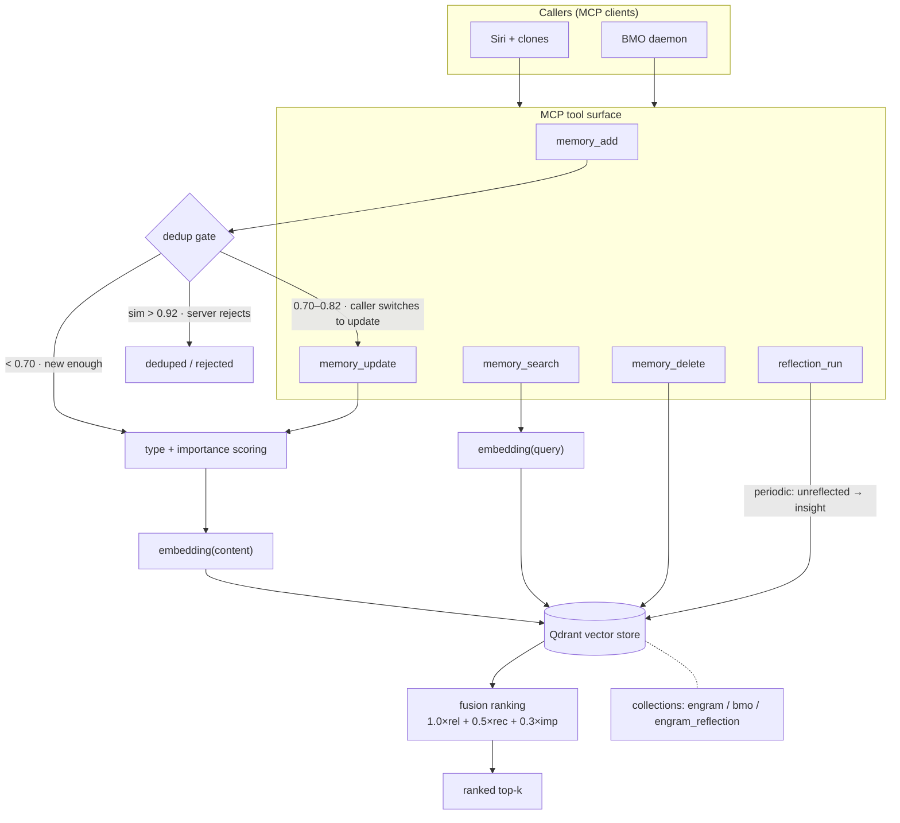

# Engram

**The memory layer that remembers what matters and forgets what doesn't.**

<!-- badges row — CI/Eval badges are static shields for now; wire up real endpoints once CI status + release are public -->
[](go.mod)
[](LICENSE)
[](eval/taskset/core_v1.json)
[](.github/workflows/pr.yml)

Engram is an agent memory service that governs **what gets stored, how long it lives, and
how it surfaces** — things a vector database alone cannot do. Unlike raw vector search, it
applies quality gates at write time (semantic dedup, importance scoring, type-based TTL)
and fuses relevance, recency, and importance at retrieval, so your agent recalls the
memories that matter. It runs as an MCP server, integrates with any MCP client in minutes,
and is written in Go on Qdrant.

**Why it's different — four things a vector DB won't do for you:**

- **Write gate.** Semantic dedup + importance scoring *before* anything hits storage — so
  the same fact rephrased ten ways doesn't flood your top-k.
- **Retrieval fusion.** Ranking is `relevance × recency × importance`, not raw cosine — the
  more important, fresher memory wins ties.
- **Type-based forgetting.** `identity`/`directive` are permanent; `event` half-fades in
  ~2.9 days and expires on a TTL. The junk decays out on its own.
- **Reflection.** Periodic synthesis folds scattered `event`s into higher-level `insight`s —
  the store gets *smarter* over time instead of just bigger.

> **Philosophy:** write-quality first. 80% of a memory system's output is decided the moment
> you write. Engram sets the gate at the door, not the mop at the exit.

**Jump to:** [Quickstart (5 min)](#quickstart) · [Core Concepts](#core-concepts) ·
[Examples](#examples) · [API Reference](#api-reference)

---

<!-- ============================== QUICKSTART ============================== -->

## Quickstart

> Goal: from zero to *"store a memory, search it back, see the fused ranking."*
> Prerequisites: **Docker** + one embedding API key (**OpenAI** or **Voyage**).

**1 — Start Qdrant (the storage backend)**

```bash
docker run -d --name engram-qdrant \
  -p 6333:6333 -p 6334:6334 \
  -v engram_qdrant_data:/qdrant/storage \
  qdrant/qdrant:v1.9.7
```

**2 — Install Engram** (pick one)

```bash
# A. fastest — install the binary
go install github.com/FBISiri/engram/cmd/engram@latest

# B. recommended for production — Qdrant + Engram together
git clone https://github.com/FBISiri/engram.git && cd engram
cp .env.example .env      # put your API key here
docker-compose up -d

# C. from source — for development
git clone https://github.com/FBISiri/engram.git && cd engram
go build -o engram ./cmd/engram/
```

**3 — Configure & run** (three env vars, then serve over MCP stdio)

```bash
export ENGRAM_QDRANT_URL=localhost:6334
export ENGRAM_OPENAI_API_KEY=sk-...        # or Voyage: ENGRAM_VOYAGE_API_KEY=pa-...
./engram serve
```

**4 — Wire it into an MCP client** (Claude Desktop / Army of the Agent)

```json
{
  "mcpServers": {
    "engram": {
      "command": "/path/to/engram",
      "args": ["serve"],
      "env": {
        "ENGRAM_QDRANT_URL": "localhost:6334",
        "ENGRAM_OPENAI_API_KEY": "sk-..."
      }
    }
  }
}
```

**5 — Store one, search one, read the score**

```python
# store (keep content in English — cross-session recall is more stable)
memory_add(
    content="Frank prefers concise commit messages, imperative mood, no emoji.",
    type="identity",
    importance=8,
    tags=["frank", "preference"],
)

# search
memory_search(query="how does Frank like commit messages", limit=3)
```

You get back a ranked list where each hit carries a `score`:

```jsonc
{
  "results": [
    {
      "id": "a1b2c3d4-...",
      "content": "Frank prefers concise commit messages, imperative mood, no emoji.",
      "type": "identity",
      "importance": 8,
      "tags": ["frank", "preference"],
      "score": 1.42          // 1.0×relevance + 0.5×recency + 0.3×importance — NOT raw cosine
    }
  ]
}
```

That `score` is the first visible difference from "just querying a vector DB": **of two
equally-relevant memories, the more important and fresher one ranks higher.**

**6 — Verify the install** (end-to-end, exercises every MCP tool incl. dedup)

```bash
ENGRAM_OPENAI_API_KEY=sk-... ./integration_test.sh
```

> Running a custom agent instead of an MCP client? Flip on the REST transport
> (`ENGRAM_TRANSPORT=http`) and hit `POST /memories/search` — see
> [API Reference → REST](#rest-api-http-transport) and
> [`docs/external-agent-quickstart.md`](docs/external-agent-quickstart.md).

---

<!-- ============================== CORE CONCEPTS ============================== -->

## Core Concepts

Five ideas and you understand what Engram is doing.

### Why not just a vector DB?

A vector database is a **retrieval primitive**, not a memory system. Bolt "embed everything,
search top-k" onto an agent and it runs great for ten minutes, then rots by week three:
context noise piles up, nothing ever decays, everything weighs the same, and the same fact
gets written ten times. Engram is the governance layer on top — dedup, importance,
type-based forgetting, retrieval fusion, reflection. The vector DB (Qdrant) is one part
inside it, not a substitute for it.

> Full argument (the four failure modes, RAG vs KV comparison) → [`docs/problem.md`](docs/problem.md).

### Memory types — decide decay rate & recall weight

| Type | Recall half-life | Typical content |
|---|---|---|
| `identity` | permanent | who I am, values, long-term preferences |
| `directive` | permanent | behavior rules, hard constraints, Frank's instructions |
| `insight` | ~144 days | lessons learned, technical observations |
| `event` | ~2.9 days | concrete things that happened, transient facts |

Type isn't a rigid taxonomy — finer distinctions go in `tags`. Type does exactly one job:
**how long this memory stays relevant, and how heavily it's weighted on recall.**

> **Two mechanisms, don't conflate them.** The *half-life* above is the time decay in
> **recall ranking** (`recency = decay^hours`); it only changes ordering, never deletes.
> A separate **TTL (`valid_until`)** decides when a memory is *hard-deleted*, graded by
> type × importance:
>
> | Type | importance <5 | 5–7 | ≥8 |
> |---|---|---|---|
> | `identity` | permanent | permanent | permanent |
> | `directive` | 90 days | permanent | permanent |
> | `insight` | 30 days | 90 days | permanent |
> | `event` | 3 days | 7 days | 30 days |
>
> `permanent` tag → never expires; `time-sensitive`/`location` tags → capped at 7 days.
> Source of truth: `pkg/memory/ttl.go` (TTL matrix) + `pkg/memory/memory.go` (decay coeffs).

### Importance (1–10) — setting it *accurate* beats setting it *high*

Importance feeds retrieval ranking. Its value is precision, not inflation: mark everything
9 and you've marked nothing. Tag the small stuff 3, so the hard constraints (8+) actually
float to the top when it counts.

### Write gate — three layers of dedup

Writing has a threshold. Three progressively-tightening layers, each catching one
degradation mode:

| Layer | Where | Rule | Catches |
|---|---|---|---|
| **① Server auto-dedup** | engram server, inside `memory_add` | similarity **> 0.92** → reject write | high-confidence *exact* duplicates |
| **② Near-dup zone (0.70–0.92)** | caller discipline (Siri/BMO) | `memory_search(limit=3)` before writing | *semantic fragments* — "same fact, different words" |
| **③ Type + importance self-check** | writer (human/rule) | pick the right `type`, set importance accurately | memories mis-filed to the wrong lifetime |

The Layer-2 decision rule for the 0.70–0.92 gray zone:

```
score = top hit of memory_search(query=<new content>, limit=3)
  > 0.82        → memory_update  (replace the old memory, don't add)
  0.70 – 0.82   → judge if semantically distinct: distinct → add; same/subset → update
  < 0.70        → memory_add     (new enough, just write it)
```

Why three layers and not just the server's 0.92? Because 0.92 only stops near-verbatim
copies. The worst decay comes from **ten paraphrases of one fact** (each 0.75–0.88 —
individually "not a dup," collectively they choke your top-k). Layer 2 owns that band.
Layer 3 owns what happens *after* the write: type sets decay rate, type × importance sets
the hard-delete TTL. **0.92 stops verbatim copies, 0.70–0.92 stops semantic fragments,
type+importance stops lifetime mismatch.**

### Retrieval fusion — not just similarity

`memory_search` ranks by a three-factor fusion:

```
score = 1.0 × relevance + 0.5 × recency + 0.3 × importance
```

Two equally-relevant hits: the fresher, more important one comes first. This is the direct
answer to the "no importance / no forgetting" failure modes.

### Reflection Engine — periodic self-synthesis

`reflection_run` pulls *unreflected* memories, uses an LLM to synthesize higher-level
`insight`s, and marks the sources as reflected. It's throttled (min 2h interval, max 3×/day,
triggers at accumulated importance ≥ 50 — all configurable) so it doesn't burn tokens.
This is Engram moving from *passive store* to *active curation*: scattered events settle
into reusable insight. (A 4-stage "focal" V2 pipeline exists in code, default-off — see
[`docs/reflection.md`](docs/reflection.md).)

### Architecture

Callers read/write via MCP tools; the write path goes through the dedup gate + scoring
before landing in Qdrant; the read path fuses ranking on the way out; reflection runs in
the background.



Memories are physically isolated by collection (`engram`, `bmo`, `engram_reflection` don't
bleed into each other); each memory's `type` lives as a Qdrant payload and drives its decay
rate and recall weight.

---

<!-- ============================== EXAMPLES ============================== -->

## Examples

Six ready-to-run configs live in [`examples/`](examples/). Each has its own README with the
scenario, launch command, and expected output.

| Example | Scenario |
|---|---|
| [`single-agent-personal-memory`](examples/single-agent-personal-memory/) | one agent, personal long-term memory |
| [`multi-agent-shared-memory`](examples/multi-agent-shared-memory/) | multiple agents sharing a memory pool |
| [`chatbot-session-memory`](examples/chatbot-session-memory/) | per-session memory for a chatbot |
| [`claude-code-mcp-integration`](examples/claude-code-mcp-integration/) | wire Engram into Claude Code as an MCP server |
| [`long-cycle-reflection-heavy`](examples/long-cycle-reflection-heavy/) | reflection-tuned config for long-running agents |
| [`qdrant-cloud-production`](examples/qdrant-cloud-production/) | Qdrant Cloud production deployment |

**Minimal single-agent snippet:**

```bash
export ENGRAM_QDRANT_URL=localhost:6334
export ENGRAM_OPENAI_API_KEY=sk-...
./engram serve
# then, from your MCP client:
#   memory_add(content="...", type="event", importance=5, tags=["project-x"])
#   memory_search(query="what happened on project-x", limit=5)
```

> Coming from an external agent and want Engram as your memory backend (not `engram serve`
> locally)? See [`docs/external-agent-quickstart.md`](docs/external-agent-quickstart.md).

---

<!-- ============================== API REFERENCE ============================== -->

## API Reference

> Cheat sheet for the hot-path tools. Full params + error codes + request/response bodies:
> [`docs/api.md`](docs/api.md).

### MCP tools (stdio transport)

Tool name = function name. Siri / BMO talk to Engram over MCP stdio.

**`memory_add`** — write a memory

| Param | Type | Req | Notes |
|---|---|---|---|
| `content` | string | ✅ | memory text (English recommended for cross-session recall) |
| `type` | string | ✅ | `identity` / `event` / `insight` / `directive` |
| `importance` | number | — | 1–10, default 5. Accurate > high |
| `tags` | string[] | — | e.g. `["frank", "preference", "thread:xxx"]` |
| `source` | string | — | `user` / `agent` / `system`, default `agent` |
| `valid_until` | number | — | expiry Unix ts (auto-computed from TTL matrix if omitted) |

```python
memory_add(content="Frank prefers road cycling before 8am.",
           type="identity", importance=7, tags=["frank", "cycling"])
```

Server auto-dedups at ≥0.92; run `memory_search` first for the 0.70–0.92 band (see Write gate).

**`memory_search`** — semantic retrieval

| Param | Type | Req | Notes |
|---|---|---|---|
| `query` | string | ✅ | natural-language question |
| `limit` | number | — | default 5, max 100 |
| `types` | string[] | — | filter by type, e.g. `["identity","directive"]` |
| `tags` | string[] | — | filter by tag (OR logic) |
| `time_start` / `time_end` | number | — | filter by created_at Unix ts |
| `collections` | string[] | — | which collections to search (default: fan-out all) |

Returns hits ranked by the fused `score` (`1.0×rel + 0.5×rec + 0.3×imp`), not raw cosine.

**`memory_update`** — semantically locate + replace an old memory. `similarity_threshold`
must be ≥ 0.85 (safety constraint).

**`memory_delete`** — delete by semantic query. `identity` / `directive` are delete-protected
(errors without `force=true`).

**`reflection_check`** → `{triggered, accumulated_importance, unreflected_count, skip_reason?}`
**`reflection_run`** → `{insights_created, sources_marked, errors[]}` (throttled: min 2h, max 3/day)

### REST API (HTTP transport)

Enabled when `ENGRAM_TRANSPORT=http` or `both`. All endpoints need
`Authorization: Bearer <ENGRAM_API_KEY>` except `/health`.

| Method | Path | Purpose |
|---|---|---|
| `GET` | `/health` | deep liveness (pings Qdrant), no auth — good for k8s probes |
| `POST` | `/memories` | create (≡ `memory_add`) |
| `GET`/`PATCH`/`PUT`/`DELETE` | `/memories/{id}` | read / partial update / replace / delete |
| `POST` | `/memories/search` | semantic search (≡ `memory_search`) |
| `POST` | `/memories/cross-search` | search across collections and merge |
| `POST` | `/collections`, `GET` `/collections` | create / list collections |
| `POST` | `/reflect`, `GET` `/reflect/check` | trigger / check reflection |
| `GET` | `/memories/expiry-candidates`, `DELETE` `/memories/expired` | TTL management |
| `GET` | `/metrics` | Prometheus metrics (op counts, latency histograms, collection size) |

```bash
curl -X POST http://localhost:8080/memories/search \
  -H "Authorization: Bearer my-key" -H "Content-Type: application/json" \
  -d '{"query": "Frank cycling habits", "limit": 5}'
```

### Error codes

| HTTP | Meaning |
|---|---|
| `200` | OK |
| `400` | bad params (missing field / type mismatch) |
| `401` | unauthenticated (Bearer missing/wrong) |
| `404` | memory ID not found |
| `409` | dedup reject (MCP tool returns `dedup_skipped: true`) |
| `429` | reflection throttled (min interval not reached) |
| `500` | internal (Qdrant down / embedding error) |

### Configuration

All config via environment variables — no config file. Minimum:

```bash
export ENGRAM_QDRANT_URL=localhost:6334     # Qdrant gRPC (default)
export ENGRAM_OPENAI_API_KEY=sk-...         # required
./engram serve
```

Full env var reference (storage / embedding / scoring weights / dedup thresholds /
reflection / OTel / TTL / multi-collection) → [`docs/configuration.md`](docs/configuration.md).

---

## Eval: 26/26 (our own, not a borrowed number)

Engram ships a regression eval (`eval/taskset/core_v1.json`) — not a marketing benchmark.
Latest run (2026-06-13, core_v1): **26/26 passing, gate PASS** (requires ≥80% overall,
≥65% per class). The 26 cases cover `retrieve_precision`, `dedup_accuracy`, `recency_bias`,
`cross_collection`, and `trajectory_replay`.

Honest about what it is: a *self-test* and a *regression guardrail* — change a dedup
threshold or a fusion weight, re-run, and you know instantly what broke. We deliberately
**don't quote mem0/Letta/Zep benchmark numbers**; their tasks and metrics differ from ours,
and borrowing someone's accuracy to flatter ourselves would be dishonest. 26/26 means only
that these 26 behaviors haven't regressed — nothing more, nothing less.

---

## Contributing

Contributions are welcome. Engram uses an **issue-first policy**: open (or find) an issue
describing the change before sending a PR, so design gets discussed before code. Read
[`CONTRIBUTING.md`](CONTRIBUTING.md) for the dev setup, coding conventions, and the eval
gate every PR must pass.

## License

MIT — see [`LICENSE`](LICENSE).
